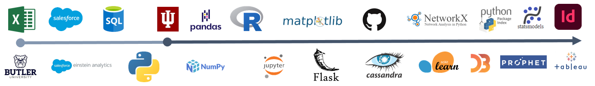

# A Data Science Learning Journey
Adam Hilgenkamp  
October 4, 2020  

Every data scientist has their own unique learning journey. It may involve a wide range of topics or the journey may lead down a specific path of expertise. In this article I wanted to provide my learning journey as one example of a possible path. I will also talk about or share some projects to give some context to the journey. My target audience for this article is students finishing their undergraduate degree or those that are just getting started with data science. That being said, I think that it may be interesting for those who have been in the industry for a while as well.  

The timeline above is a rough representation of my journey. It highlights some of the key tools that I have learned and have used in some of my projects. There are additional concepts and details behind each one of these tools but I wanted to provide a high level summary. I have also made a point to separate out the education component of my journey. The reason for this is to show how I started to learn some of the core concepts organically and then how my learning journey was accelerated through grad school. During this entire time period I was working full time in Finance. Balancing work and school was difficult at times but I think the benefits of applying what I was learning outweighed the costs. This choice depends on a lot of factors and may not always be possible but for me I found it to be helpful.

## Post Undergrad (About 2 years)

I graduated Butler University in 2015 with a degree in Finance. I had not yet been exposed to data science and was working exclusively in Microsoft Excel. Excel is commonly used and is a good tool for some basic analysis and modeling. However, when I was responsible for updating models that had large amounts of data and required lots of data manipulation it became time to find a better solution. I had a friend at work who knew SQL and he was able to teach me some of the basics. From that foundation I was able to start to move some of the Excel manipulation to SQL, saving time and frustration. While I was learning SQL I relied heavily on resources such as w3schools and Stack Overflow. What I took away from this experience is that you can learn quite a bit with the right google searches but it is also a good idea to find a mentor as you learn.

At the same time I was learning SQL, I was learning Salesforce as well as Einstein Analytics, which is a data visualization tool. Learning Salesforce was important as much of the data I was using for financial analysis was retrieved from the platform. To get the right data I needed to understand how the data objects were related and the business context around how the data was recorded. Once I had the data I needed to learn how to use Einstein Analytics in order to build dashboards to share metrics and communicate any insights. I invested a lot of time in data visualization and design theory as I think it is critical when presenting analysis effectively to business stakeholders.

As I better understood the data in Salesforce, became more comfortable transforming data with SQL, and visualizing the data with Einstein Analytics I started to look for ways to improve my process. I was not working on complex analysis yet and many of my processes had manual steps. In an effort to automate these processes my next learning goal was Python. I started learning the basics on Code Academy and chose a few small projects to work on in order to try out some of what I was learning. This worked well but I didn&#39;t have a mentor to help me with Python and I was having trouble figuring out what I needed to learn in order to effectively apply it. My desire for structure was one of the main reasons that I choose to go back to school.

## Grad School (About 3.5 years)

When I first started the Data Science Master&#39;s program at Indiana University I needed to develop my programming skills. I started by taking the onboarding course that was offered and I focused on R and Python. For Python I specifically focused on popular packages such as Pandas and Numpy. As I was learning the language in class I was trying to apply what I was learning in order to automate some of my data processes at work. I ultimately chose Python and learned how to use the CX\_Oracle package to interact with my companies databases. If you are choosing between the two languages I would recommend going deep in Python but would consider spending some time getting familiar with R as well.

The next course that I took was statistics. I think this is one of the most important courses that I took. A solid foundation in statistics and the thinking behind it are important when approaching data driven projects. I have continued to read books on the topic and for a basic and high level introduction I would recommend &quot;Naked Statistics&quot; by Charles Wheelan.

After statistics I took courses in data visualization and SQL/NoSQL. Until this point I had been doing some work in SQL and building dashboards at work. It was really helpful to be exposed to additional types of databases such as Redis, Neo4j, and Cassandra as well as more advanced concepts of SQL. I was able to use this immediately in my work to improve the way I was building queries to analyze our data. I do want to say that spending time understanding the business and context of the data is equally if not more important than the technical concepts.

During my data visualization class I learned a lot of design concepts that I applied to many of the dashboards that I was building for work. I was also exposed to the visualization libraries in Python such as Matplotlib, Altair, and Seaborn. I did not apply this extensively at the time but used them later on for research projects in my job. Another tool that I learned during this time was Jupyter Notebooks. This tool has become an essential part of my research and development work and I would recommend setting this up early on in your journey.

The next class that I took was on big data infrastructure. The course was a survey of cloud computing and infrastructure which was helpful to get exposed to the multitude of options. Ultimately, I learned the most from my project in this class. I worked on building a smart thermostat using a raspberry pi and then created a website using the Flask framework in python. I also created a raspberry pi cluster to host the website and set up a Cassandra database on the server to handle the data for the thermostat. This project also introduced me to working with GitHub which has become an important way for me to keep track of project code and changes.

The 6th course that I took was network science. This course helped me to improve my knowledge of statistics, linear algebra, and calculus which would become really important when I later took machine learning courses. For tools I was able to learn about the NetworkX package in Python and Gephi for visualizing graph data. I didn&#39;t know how I would use these tools at the time but later used them in my job to graph out the relationships between datasets and dashboards.

While working on my course work for graduate school I also started working on a python package for Einstein Analytics which is a data visualization tool. In the process of working on this package to make things easier for my job I learned about API&#39;s as well as how to contribute to the python package index. Learning how to take code that I was using for my own purposes and packaging it for others to use helped me to improve my python skills as well.

Finally, I took courses in machine learning and data mining. In these courses I learned the mathematics and the theory behind some of the popular machine learning algorithms. This was an important foundation to have before trying to apply these methods to real world data. It was also during this time that I transitioned roles at work and was tasked with working on a team that was developing ML models for late paying invoices. In this phase of my learning journey I started to use Sklearn, imblearn, and Keras to build and test models.

## What&#39;s Next?

As I look at what is next on my learning journey there are three main tracks; technical skills, communication skills and project management skills. On the technical side I have started to explore time series models. Specifically, Facebook&#39;s Prophet Model and the Statsmodels library in python. Working in the Finance field new methods of forecasting are particularly useful. Drawing on what I have learned so far my goal is to develop forecasting applications that can provide an accurate check point for the analysts tasked with setting the company metric forecasts.

Communication is an important skill for a data scientist. Based on my admittedly limited experience I think this is one of the most important things for me to continue to develop. Presenting the results effectively either though emails, dashboards (Tableau, D3.js), or traditional presentations will make or break a project. If the key stakeholders don&#39;t understand the information or it takes a lot of effort to extract the needed information then the usage will suffer. Design theory, user experience, and data culture are important areas of study for me as I work to improve the way that my team and I deliver information.

Lastly, planning the project and executing well are skills that I want to focus on improving. There are many books on the subject that provide some frameworks to build upon. Additionally, learning some tools such as Jira, GitHub, Smartsheets, or Asana can make it easier to keep track of projects. Ultimately, I think the key to success in data science is to keep learning, be curious, take risks, and communicate effectively with the people that you work with.
